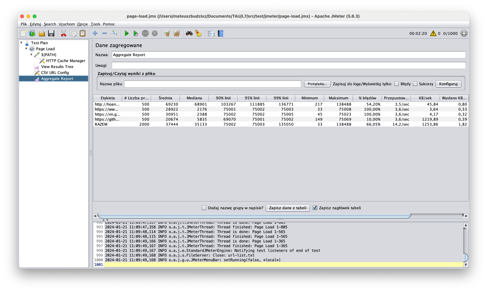

# JMeter
Na podstawie https://github.com/hoantran-it/jmeter-webload-example

## Wyniki testów

## W formie tabeli
|Etykieta                        |# Liczba próbek|Średnia|Mediana|90% linii|95% linii|99% linii|Minimum|Maksimum|% błędów|Przepustowość|KB/sek |Wysłano KB/sek|
|--------------------------------|---------------|-------|-------|---------|---------|---------|-------|--------|--------|-------------|-------|--------------|
|http://hoantran-it.blogspot.com/|500            |69230  |68901  |103267   |111885   |136771   |217    |138488  |54,200% |3,54063      |45,84  |0,80          |
|https://www.hackerrank.com/     |500            |28922  |2176   |75001    |75002    |75003    |33     |75008   |100,000%|3,60368      |3,64   |0,33          |
|https://vn.godaddy.com/         |500            |30951  |2388   |75002    |75002    |75005    |45     |75023   |100,000%|3,60251      |4,17   |0,32          |
|https://github.com/hoantran-it  |500            |20674  |5835   |69070    |75001    |75002    |149    |75069   |10,000% |3,59824      |1219,89|0,39          |
|RAZEM                           |2000           |37444  |35133  |75002    |75003    |135050   |33     |138488  |66,050% |14,16240     |1253,86|1,82          |

## Wnioski
Wszystkie z podanych stron posiadają zabezpieczenia przeciwko atakom DDOS, w wyniku czego zdecydowana większość zapytań zakończyła się niepowiedzeniem. 

Duża różnica czasów minimalnych od maksymalnych wskazuje na braki w optymalizacji podanych stron, ponieważ 500 razy zapytaliśmy o ten sam adres, więc można było zapisać wynik takiego zapytania, i uniknąć długich czasów.

Podane strony bez zastosowania podanej optymalizacji są w stanie obsłużyć ok 3 zapytań na sekundę.
